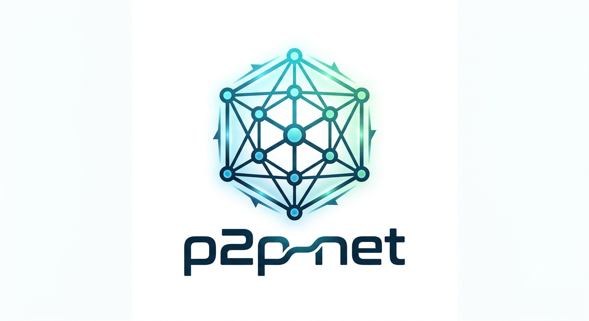

# p2p-net

`p2p-net` is a Rust libp2p node core that gives applications a small, stable API for peer connectivity and messaging while the crate handles transport mechanics, discovery, relay fallback, DCUtR hole punching, native WebRTC-direct, telemetry, and platform storage/runtime details.

<p align="center">
  
</p>

## Features

- Native transports: TCP, QUIC, WebSocket, browser-compatible `/webrtc-direct`, DNS, Noise, Yamux
- Discovery: Kademlia provider records, peer cache, bootstrap seeds, rendezvous, and public fallback policy
- NAT traversal: relay client/reservations, DCUtR direct upgrades, AutoNAT, and optional mediator/relay server profiles
- App API: six data-plane primitives on `NodeHandle`, plus `get_metrics()` for infrastructure telemetry
- Safety/ops: connection caps, replay/timestamp checks, peer scoring, snapshots, Prometheus-style export, and dashboard UI
- Portability: platform runtime/storage abstraction and binding-safe facade for desktop, mobile, and WebView shells

DNS support is enabled by default for configured and cached peers through p2p-net's own startup resolver. Peer addresses using `/dns`, `/dns4`, `/dns6`, or `/dnsaddr` are resolved before dialing. WebSocket support in rust-libp2p 0.56 requires the `libp2p-dns` adapter crate, so p2p-net patches that crate to a local no-Hickory implementation instead of using the crates.io resolver path. The disallowed upstream mDNS adapter crate is policy-patched to a local no-op placeholder so the rejected Hickory DNS line stays out of `Cargo.lock`. `/dnsaddr` uses bounded DNS-over-HTTPS TXT lookup support with a configurable endpoint in p2p-net's own resolver. The default endpoint is Cloudflare for simple out-of-the-box operation; production deployments can point it at an internal/self-hosted DoH resolver or disable `/dnsaddr` entirely. LAN multicast discovery/mDNS is not included.


## Repository layout

```text
crates/              Shared Rust P2P core modules
docs/impl/          Implementation docs
docs/spec/          Core specifications
docs/operator/      Operator deployment guides
docs/validation/    Validation docs
docs/project/       Project/audit notes
docs/future-work/   Deferred ideas and long-term proposals
docs/roadmap.md      Active roadmap, when one exists
qa/ci/              Validation policy/config helpers used by the root launchers
qa/tests/           Domain-grouped global/system/invariant integration tests
qa/fuzz/            Fuzz targets
qa/tools/           Internal QA utilities
qa/vectors/         Protocol fixtures and test vectors
examples/           Runnable examples and minimal demo configs
external/           Local third-party crate patches
```

## Run all stable tests and checks

Use the single full-validation launcher for your OS from the crate root. On Windows, double-click `run-full-validation.cmd`; on Linux, `run-full-validation.sh` is executable and can be launched directly from a file manager/terminal:

```cmd
run-full-validation.cmd
```

It cleans stale build artifacts, verifies the committed dependency lockfile with `--locked`, checks formatting without mutating source, then runs tests, dashboard-feature tests, clippy, `cargo audit`, `cargo deny`, and ignored load/soak tests. It uses isolated validation target directories to avoid stale/incomplete `rlib` artifacts on Windows. Rust is pinned to 1.98.0, audit/deny tool releases are pinned, and missing exact tool versions are installed unless `--no-install-tools` is used.

Useful options:

```cmd
run-full-validation.cmd --skip-ignored
run-full-validation.cmd --no-install-tools
run-full-validation.cmd --no-clean
```

Linux equivalent:

```bash
./run-full-validation.sh
```

Fuzz targets are included under `qa/fuzz/`. They are not part of the cross-platform stable launcher, but the scheduled security workflow builds/runs every target and also runs the ignored hostile/load suite. Additional validation and hostile-network notes are in `docs/validation/VALIDATION.md`.


## The General-Purpose Application API

Applications should build on our stable, high-level API surface instead of depending on low-level swarm or libp2p internals. Every application builds on the same six primitives exposed by `NodeHandle`:

```rust
// Establish connection to a target address
handle.connect_peer(addr).await?;

// Drop connection to a peer
handle.disconnect_peer(peer_id).await?;

// Addressed delivery to a specific peer. The carrier is gossipsub, so encrypt
// payloads end-to-end when confidentiality is required.
handle.send_message(peer_id, "chat/general", payload).await?;

// Gossip/PubSub broadcast to all subscribed peers on a topic
handle.broadcast("game/lobby", payload).await?;

// Subscribe to a topic and receive a local message stream
let mut messages = handle.subscribe("chat/general").await?;

// Query known peers and discovery metrics
let peers = handle.get_peers().await?;
```

This simple interface effectively decouples your business logic (chat, gaming, database sync) from transport mechanics (TCP, WebRTC, QUIC, NAT-punting).

Application messages use `AppMessage` envelopes and app topics namespaced as `p2p-net/app/v2/net-<network_id>/<topic>`. See `docs/spec/API_PRIMITIVES.md` and `docs/impl/API_IMPLEMENTATION.md`.

### Telemetry without payment logic

The core primitives stay free of wallet, token, and payment-settlement code. Applications that need usage accounting can build those layers above the node by calling the seventh query/management primitive:

```rust
let all_metrics = handle.get_metrics(None).await?;
let peer_metrics = handle.get_metrics(Some(peer_id)).await?;
```

`get_metrics()` reports runtime-owned bandwidth, storage, and compute counters, including per-peer and per-topic bandwidth where available. That gives apps enough low-level data to implement custom settlement, micropayment, quota, or billing systems without coupling financial logic into the networking core.

## Start a node

Generate the example's full-node config:

```powershell
cargo run --release --features dashboard --example p2p_node -- --write-default-config p2p-node.json
```

Run with the config:

```powershell
cargo run --release --features dashboard --example p2p_node -- --config p2p-node.json
```

The standalone example is deliberately production-shaped rather than throttled: it selects the `full` profile, runs a Kademlia server, keeps all configured inbound transports available, uses the normal 5-second Gossipsub heartbeat and 15-second Ping cadence, uses the normal three-way DHT query parallelism/provider-key replication, and retains the standard production connection-safety policy. Developers can copy the generated JSON and selectively change roles, listeners, limits, or discovery policy for their deployment. Runtime optimizations are implemented in hot paths instead of by silently reducing protocol capability: public Kademlia request events bypass app-side bookkeeping, DHT/provider observability is coalesced, duplicate Identify/public-address work is suppressed, peer-cache writes are deduplicated and batched, and recovery refreshes cannot form a discovery-to-connection feedback loop. Native WebRTC-direct also bounds and expires unverified pre-handshake UDP state, cleans failed/cancelled ICE mux connections, and closes peer connections on drop so public listener churn cannot retain transport state indefinitely.

Press `q` or `Esc`, use Ctrl-C, or close the console window to stop the dashboard node cleanly. Windows console close/logoff/shutdown and Unix SIGTERM/SIGHUP are handled, and node shutdown has a one-second fail-safe before its runtime task is aborted.

Run and ship optimized release builds. Debug-mode libp2p/crypto/network code is substantially more CPU-intensive and is intended for development diagnostics only.

## Default connectivity model

Normal app mode uses public fallback by default:

```text
fresh node -> public fallback joins discovery -> app peers are discovered -> network auto-connect attempts start -> contact trust still requires invite/QR/join-code
```

Regular users should not have to edit bootstrap settings before first launch. Manual `bootstrap_peers`, `discovery.bootstrap_seed_peers`, `discovery.rendezvous_peers`, and `relay_peers` are power-user/operator controls and should be exposed under Advanced settings in app UIs.

Auto-connect is **not** auto-trust. A peer discovered through public fallback, DHT provider records, or rendezvous may be dialed at the transport layer, but it must not become a trusted chat/contact identity until the app performs an explicit trust action such as QR scan, join code, invite acceptance, or safety-number verification.

The shared crate ships public bootstrap defaults and config slots for public app rendezvous and public relay/mediator candidates. It does not ship a project-operated public rendezvous or relay fleet. Public bootstrap alone is not enough to guarantee two fresh NATed installs can reach each other; apps that need reliable run-two-fresh-installs connectivity should add real public rendezvous DNSADDR entries under `discovery.public_bootstrap.rendezvous_peers` and real public relay/mediator DNSADDR entries under `discovery.public_bootstrap.relay_peers`, or operate private infrastructure.

Runtime snapshots and Prometheus metrics report public fallback by category: `public_bootstrap_used`, `public_rendezvous_used`, and `public_relay_used`. Peer metadata also distinguishes `public_rendezvous` from operator-provided `rendezvous` sources.

Private-infrastructure-first operation is still supported as an Advanced/operator mode by setting `discovery.public_bootstrap.mode` to `disabled` and configuring owned bootstrap/rendezvous/relay infrastructure explicitly. See `docs/operator/CONSUMER_DEFAULT.md` for the normal app walkthrough and `docs/operator/PRIVATE_INFRASTRUCTURE_FIRST.md` for the private mode override.

## Configure a node

Edit `p2p-node.json`. The default config is also available at:

```text
examples/node-config.example.json
```

Example configs are also available:

```text
examples/consumer-default.config.json
examples/public-fallback.config.json
examples/private-infrastructure-first.config.json
```

Use `examples/consumer-default.config.json` for normal app mode. `examples/public-fallback.config.json` is an expanded public-fallback example for operators and power users. `examples/private-infrastructure-first.config.json` is the Advanced/operator private mode.

Operator guidance is in `docs/operator/`.

Important fields:

- `profile`: high-level node role selection: `auto`, `full`, `lite`, `relay`, `mediator`, `rendezvous`, `bootstrap`, or `mobile_lite`.
- `identity_key_path`: stable private node identity; keep this file private and back it up according to `docs/spec/IDENTITY_KEY_BACKUP_ROTATION.md`.
- `listen_addresses`: local TCP/QUIC/WebSocket/WebRTC-direct listen multiaddrs. Use concrete `/ip4` or `/ip6` listen addresses, not DNS names.
- `listeners`: per-transport inbound listener switches. Set `websocket` and/or `webrtc_direct` to `false` when those inbound transports are not needed; outbound dial support remains available.
- `bootstrap_peers`: trusted `/p2p/<PeerId>` bootstrap multiaddrs. `/dns`, `/dns4`, `/dns6`, and `/dnsaddr` dial addresses are supported by default.
- `dnsaddr`: `/dnsaddr` DoH policy. Defaults to bounded Cloudflare DoH for simple operation; set `doh_endpoint` to an internal/self-hosted DoH resolver for production, or set `enabled` to `false` to reject `/dnsaddr` in configured peers. See `docs/impl/DNSADDR_DOH.md`.
- `relay_peers`: operator-pinned relay or mediator peers to dial and reserve through.
- `discovery.namespace`: derive hashed app/contact/group discovery namespaces from `network_id`, `app_id`, and tags. See `docs/spec/DISCOVERY_NAMESPACES.md`.
- `discovery.public_bootstrap`: public bootstrap, rendezvous, relay, and network auto-connect fallback. Defaults to `fallback_only` for normal app mode; set `disabled` for private-infrastructure-first mode or `always` for aggressive public fallback. See `docs/spec/PUBLIC_FALLBACK.md`.
- `discovery.dht`: announce and query hashed app namespaces through Kademlia provider records. See `docs/spec/DHT_PROVIDER_DISCOVERY.md`.
- `discovery.relay_discovery`: select relay candidates from configured relays, cached healthy peers, and rendezvous infrastructure. See `docs/impl/RELAY_DISCOVERY.md`.
- `dcutr`: direct-connection upgrade policy with relay fallback, retry budget, and observability. See `docs/impl/DCUTR_POLICY.md`.
- `start_node_with_platform(...)`: embed the shared core with platform runtime/storage adapters. See `docs/impl/PLATFORM_RUNTIME.md`.
- `bindings`: binding-safe JSON/enum facade for Kotlin, Swift, desktop, and WebView shells. See `docs/impl/BINDINGS.md`.
- `NodeHandle`: six app data-plane primitives plus `get_metrics()` for runtime-owned telemetry. See `docs/spec/API_PRIMITIVES.md`.
- `reserve_configured_relays`: request `/p2p-circuit` reservations from selected relays.
- `discovery.rendezvous`: enable rendezvous client/server registration/discovery.
- `connection_limits`: global, per-peer, and per-IP connection caps.
- `message_security`: heartbeat size, timestamp, replay, and reputation settings.
- Heartbeat gossip uses the compact binary `p2p-net/heartbeat/v2` wire format; the former JSON heartbeat wire is intentionally version-separated.
- `mediator`: first-class DCUtR mediator policy. `profile = "mediator"` enables the underlying relay server capability intentionally for lite/mobile peers. See `docs/impl/MEDIATOR.md`.
- `relay.enabled`: opt-in generic relay server mode. Defaults to `false`.
- `relay.allow_peers` / `relay.deny_peers`: connection-level relay-node ACLs; deny wins.
- `relay.schedule`: UTC relay service windows.

Minimal volunteer relay config:

```json
{
  "relay": {
    "enabled": true
  }
}
```

Minimal DCUtR mediator config:

```json
{
  "profile": "mediator"
}
```

Relay/mediator ACL note: current ACL enforcement is connection-level. A peer denied from relay/mediator use is denied from connecting to that node at all.

## Production-readiness status

The shared core and full-node example are hardened for production use when the repository release gates are green: exact Rust/toolchain inputs, committed `Cargo.lock`, tests/clippy/audit/deny, hostile/soak coverage, and scheduled fuzzing. Network-facing state is bounded, identity persistence is fail-closed, application envelopes are authenticated against signed gossipsub authors/topics, and the full node keeps Kademlia/relay/WebRTC capabilities enabled by default.

Production operators still own deployment concerns that no library can supply automatically: monitoring/alerting, identity backup/rotation, firewall/NAT policy, capacity planning, secure application payload design, and representative multi-host soak testing. External security review is strongly recommended for high-value deployments, but is not substituted by or falsely implied by the repository's automated gates.

## Manual checks

Normally, do not run the individual commands manually. Use `run-full-validation.cmd` on Windows or `./run-full-validation.sh` on Linux; these are the canonical root-level one-file validation runners for formatting, tests, clippy, security audit, dependency policy, and ignored load/soak tests.

- `docs/impl/EVENT_HANDLING.md` documents the single-responsibility swarm event split.
- `docs/impl/BEHAVIOUR_POLICY.md` documents profile-driven behaviour construction.
- `docs/impl/RELAY_DISCOVERY.md` documents relay discovery and selection.
- `docs/impl/DCUTR_POLICY.md` documents DCUtR policy and fallback counters.
- `docs/impl/PLATFORM_RUNTIME.md` documents the platform runtime/storage abstraction.
- `docs/impl/BINDINGS.md` documents the cross-platform binding facade.
- `docs/spec/API_PRIMITIVES.md` documents the application API and telemetry query primitive.
- `docs/spec/DISCOVERY_RESURRECTION.md` documents consumer-default public fallback, advanced private-infrastructure mode, and peer roles.
- `docs/spec/DISCOVERY_NAMESPACES.md` documents hashed app discovery namespace derivation.
- `docs/spec/PUBLIC_FALLBACK.md` documents default public bootstrap, rendezvous, relay, and auto-connect fallback policy.
- `docs/operator/README.md` links deployment examples and production operator guidance.
- `docs/spec/DHT_PROVIDER_DISCOVERY.md` documents DHT provider-record namespace discovery.
- `docs/spec/PEER_BOOK.md` documents normalized peer metadata returned by `get_peers()`.
- `docs/impl/DHT_PROVIDER_DISCOVERY_IMPLEMENTATION.md` documents DHT provider wiring and observability.
- `docs/impl/PEER_BOOK_IMPLEMENTATION.md` documents peer-book update paths and observability.
- `docs/impl/PUBLIC_FALLBACK_IMPLEMENTATION.md` documents the startup wiring for public fallback.
- `docs/impl/API_IMPLEMENTATION.md` documents API command routing and message delivery.
- `qa/tests/hygiene/codebase_hygiene.rs` guards repository/layout and profile-decision hygiene, while `qa/tests/hygiene/codebase_architecture_hygiene.rs` guards focused module ownership and complete, unique test registration.
